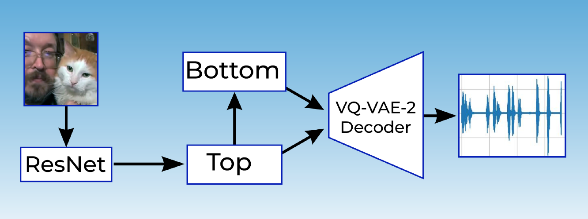

# ВКР бакалавра

Текст и код моей выпускной квалификационной работы. \
Суть проекта: реализация алгоритма для генерации звука по входному видео.

## Архитектура

Пайплайн включает нейросеть-энкодер для видео, а также языковую модель и автоэнкодер (VQ-VAE-2) для генерации и декодирования звуковой информации соответственно.

В рамках ограниченных ресурсов в качестве энкодера был взят ResNet, в будущем я планирую дообучить все нейросети для работы с эмбеддингами CLIP.

## Результат 

Все компоненты обучались на бесплатных мощностях, так что алгоритм не претендует на SOTA-качество. В обучении автоэнкодера были достигнуты определённые успехи. Из-за ограниченных ресурсов модель не обучилась генерировать связное аудио, но была реализована корректно, о чём можно судить по значению метрик (Perplexity, CE).

Комиссия оценила работу на **98 баллов**. Я также был награждён дипломом II степени за **лучшую ВКР** своего факультета.

В процессе работы был собран [датасет](https://www.kaggle.com/datasets/kitonbass/vgg-sound-only-cat-and-dog-sounds) со звуками кошек и собак, основанный на датасете VGG Sound. Он ограничен звуками двух животных, чтобы можно было обучать модели на сравнительно небольшой, но разнообразной выборке в условиях ограниченных мощностей.

